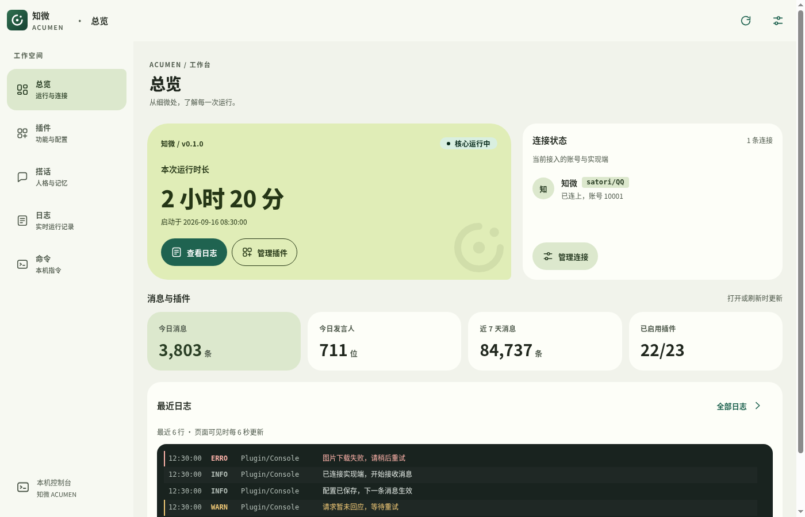
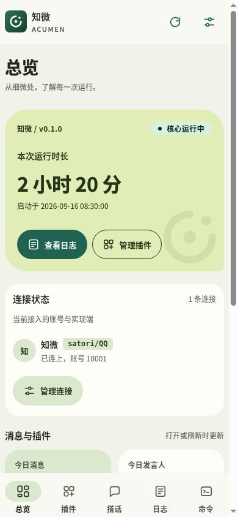
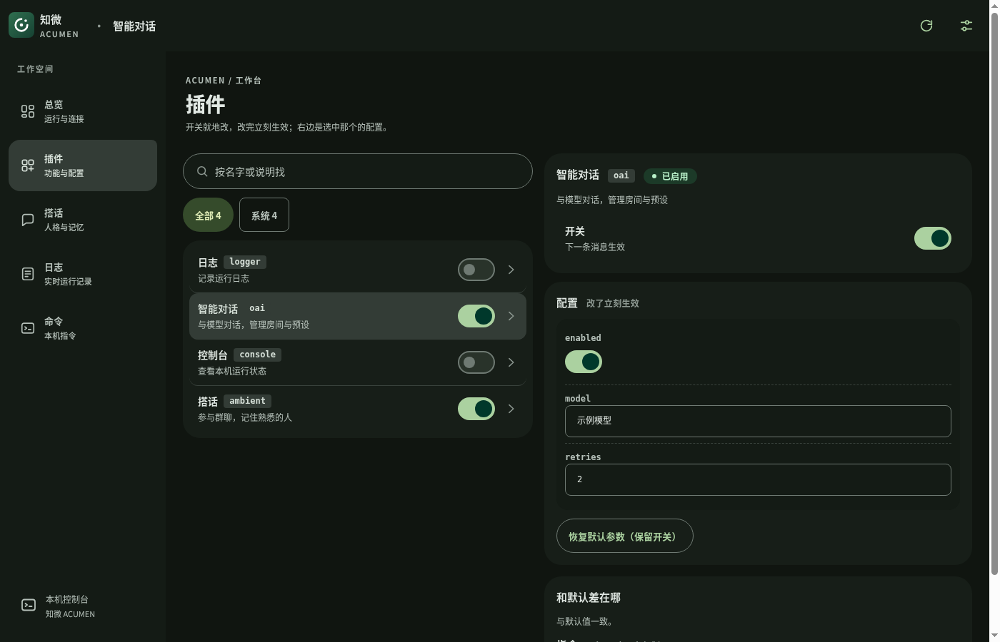

# 知微 WebUI 设计系统

2026-09-22。此文是当前控制台及其图标的规范；旧审计文档保留历史决策。视觉以松绿、浅苔色容器、开环标记和有节奏的圆角构成一套语言，页面不加载任何远程 UI 库或字体。

## 依据与裁决

冲突顺序固定为：**平台原生规范 > 可用性与无障碍 > 产品一致性 > M3E > Carbon > Miuix**。

| 来源 | 在产品中的职责 | 具体取舍 |
| --- | --- | --- |
| [Material 3 Expressive](https://m3.material.io/blog/building-with-m3-expressive) | 色彩角色、形状、排字、状态层与动效 | 运行卡使用强调容器与不对称圆角，其他卡片保持安静；主要动作使用实色 |
| [Apple HIG](https://developer.apple.com/design/human-interface-guidelines/) | 平台体验 | 系统字体优先、安全区、原生表单和 dialog、浏览器前进后退、Apple 图标由平台裁形 |
| [Carbon](https://carbondesignsystem.com/components/data-table/usage/) | Web 信息组织 | 列表与详情、配置分组、过滤与空态、信息密度、可键盘操作的滚动区；不引入 Carbon 视觉组件 |
| Miuix | 视觉精修 | 图标笔画与光学间距、数字行高；不提供独立颜色、组件或交互体系 |
| [WCAG 2.2](https://www.w3.org/TR/WCAG22/) | 可用性下限 | 正文对比度、非文本控件边界、键盘焦点、回流、状态播报、无障碍名称 |

48px 控件是产品统一目标，比 WCAG 2.2 AA 的 24px 最小目标更宽裕；并非把 Apple 的 pt 或 Android 的 dp 直接当成 Web 像素。72px 导航栏与 232px 桌面侧栏也是本产品取值，不宣称是任何体系的强制规格。

## Tokens 的唯一来源

后端按下列顺序合并 CSS。新增值进入对应层，不在组件选择器或 JavaScript 中另建调色板。

| 层 | 文件 | 负责内容 |
| --- | --- | --- |
| 系统 | `res/cards/m3e.css` | 语义配色、基础字阶、间距、形状与阴影；WebUI 配色集中在 `scheme-console` 的浅深两套方案 |
| 产品 | `res/console/tokens.css` | Web 字阶、系统字体、安全区、触控尺寸、导航宽度、组件形状、运动参数与阅读密度 |
| 组件 | `res/console/app.css` | 只引用 Tokens，定义布局、状态与响应式规则 |

主要配对：`primary/on-primary` 用于主动作；`primary-container/on-primary-container` 用于运行状态；`secondary-container/on-secondary-container` 用于选中项；`surface/on-surface` 用于内容；`outline` 用于控件边界，`outline-variant` 仅用于装饰分隔。禁止只改背景、不核对对应前景。

| 类别 | 令牌 / 当前值 |
| --- | --- |
| 标题 | `headline-medium` 28px；运行数字 `display-small` 40px，窄屏 32px |
| 正文 | 紧凑 14/13/12px；舒适 16/15/14px；手机输入至少 16px |
| 几何 | `--zy-touch` 48px；`--md-shape-card` 24px；`--md-shape-hero` 36px；强调角 8px |
| 外壳 | 顶栏与底栏 72px；导航轨 96px；侧栏 232px；安全区额外累加 |
| 间距 | 使用 `--md-space-*`，页面内容主间距 20px；桌面外边距 24px |
| 动效 | 空间 350–500ms，效果 150–200ms；用户减少动态效果时去除入场、涟漪与循环动画 |
| 状态层 | hover 8%、press 12%；disabled 与 busy 阻止重复提交 |

组件层使用 `--md-*` 或 `--zy-*`，禁止颜色、字号、圆角与阴影字面量。Rust 资源测试验证令牌存在、分层、离线资源和图标产物。

## 组件契约

| 组件 | 行为 / 状态 | 无障碍要求 |
| --- | --- | --- |
| 导航 | 同一组 5 个真实链接；底栏 → 轨 → 侧栏，桌面附说明 | `aria-current="page"`；浏览器历史有效，键盘首站为跳到内容 |
| 页头 | 每页一个 h1；区域标题 h2；路由变化同步页面标题 | 换页后焦点到页标题；错误与空态也保留标题 |
| 运行卡 | 时长、版本、启动时间；核心与连接分开呈现 | “核心运行中”不意味着外部账号已连接；状态有文字 |
| 统计 | 四个读数；窄屏两列，宽屏四列 | 单位可读，数字等宽；明确数据更新时间 |
| 按钮 | 实色主动作、色调次动作、轮廓低强调、文字辅助动作 | 48px 目标、可见焦点、忙碌与禁用态；图标按钮必须有名称 |
| 筛选 | chip 独立筛选；seg 互斥选择 | `aria-pressed`；筛选保留焦点与日志订阅 |
| 开关 | 视觉轨道 52×32，命中区域至少 48px 高 | 原生 button + `role="switch"` + `aria-checked`，Space/Enter 可操作 |
| 插件列表 | 行身打开详情、尾部开关独立；宽屏两栏 | 链接与按钮不嵌套，当前详情通过链接 `aria-current` 表达 |
| 配置 | 标签、输入和动作明确分组，长值可换行 | 所有输入有名称；手机系统键盘与缩放行为保留 |
| 日志 | 深色工作区、过滤、暂停、导出、连接反馈 | 区域可键盘滚动；级别有文字；不逐条播报高频日志 |
| 对话框 | 浏览器原生 modal；危险操作先确认 | 名称与描述关联；初始落在取消；Esc 取消并返回触发控件 |
| 反馈 | 成功 / 进行中为 status，失败为 alert | 避免双重 live region；关闭按钮可达 |

小于 600px 使用底栏，600–839px 使用轨，840px 起侧栏与插件双栏，1100px 起总览状态和连接并排。总览 DOM 阅读顺序与视觉顺序一致。320px 下允许纵向延展，复杂字段折为一列。

## 图标

`scripts/make-icon.py` 是应用标记的几何源：108 网格、270° 开环、中心细节点与右上焦点；环半径 25、笔画 8、中心点半径 7。16px 下笔画约 1.19px；所有前景在半径 33 的安全圆内。

SVG、192/512 PNG、maskable、monochrome 和 Apple 180px 图标均由同一几何生成。普通图标自带圆角，maskable 与 Apple 图标铺满不透明背景，由系统裁形；单色层透明底、白色前景。浏览器是否将 manifest 的 monochrome 用于主题图标取决于平台支持。

功能图标统一 24×24、1.8px 圆头描边、`currentColor`。总览用分格、日志用记录页、设置用调节器；装饰 SVG 对辅助技术隐藏，按钮本身承担名称。

## 验证与复现

```sh
cargo test --locked
cargo build --release --locked
node tests/console-backend.cjs
ACUMEN_CONSOLE_SHOTS="$TMPDIR/acumen-review" node tests/console.cjs
python3 scripts/audit-contrast.py
```

浏览器回归使用隔离 HTTP 夹具，覆盖 320/390/800/1400px × 浅深色 × 8 个页面状态，同时检查文字、边界、占位文字、目标大小与名称。额外检查对话框键盘行为、文字间距覆盖、减少动态效果及日志性能。生产审计只读取页面。

可选使用 axe-core 4.13.0 扫描同一矩阵；无需给产品添加 npm 依赖：

```sh
npm install --prefix "$TMPDIR/acumen-a11y" --no-audit --no-fund axe-core@4.13.0
ACUMEN_AXE_CORE="$TMPDIR/acumen-a11y/node_modules/axe-core/axe.min.js" \
ACUMEN_CONSOLE_SHOTS="$TMPDIR/acumen-review" node tests/console.cjs
```

自动检查不等于完整 WCAG 认证。VoiceOver / TalkBack 的实际朗读、iOS 安装和真实设备安全区仍需平台实机验收；这里分别记录可重复的自动结果与尚未完成的人工验证。

## 本轮验证记录

- `cargo test --locked`：526 通过，38 项按仓库既有条件忽略，0 失败。
- Chromium 64 个页面快照：逐元素对比度、边界、名称、目标与 axe-core 4.13.0 的 WCAG A/AA 规则均无失败。浅深两档、四种宽度、总览 / 插件 / 两种详情 / 搭话 / 日志 / 命令 / 设置均覆盖。
- 原生对话框取消焦点、Tab、Esc 与返回触发点通过；320px 文字间距覆盖、键盘焦点不被顶底栏完全遮挡、系统高对比与减少动态效果检查通过。
- 2400 行日志突发：7 次 DOM 变更，未记录到 ≥50ms 的长任务。采样窗口仅覆盖突发阶段，后续换页不混入该指标；设备整体负载仍会影响时延。
- 隔离 release 后端验证口令、配置读写、SSE、ETag、资源内嵌与优雅退出；测试实例 `bots=[]`。
- 图标安全圆、16px 笔画、Apple / maskable 全不透明及 monochrome 透明背景已检查。
- 当前 runit 实例已更新，11 项静态资源与源码逐字节一致；连接恢复，22/22 插件启用、无待重启项。真实页面 42 个快照（三档宽度 × 浅深色 × 七页）的对比度、控件边界、目标、名称与占位文字审计通过。

下列截图使用隔离夹具，数据仅作界面演示，不含线上账号或日志。




