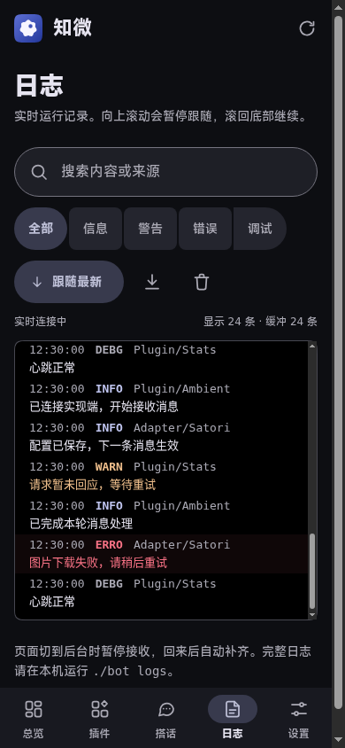
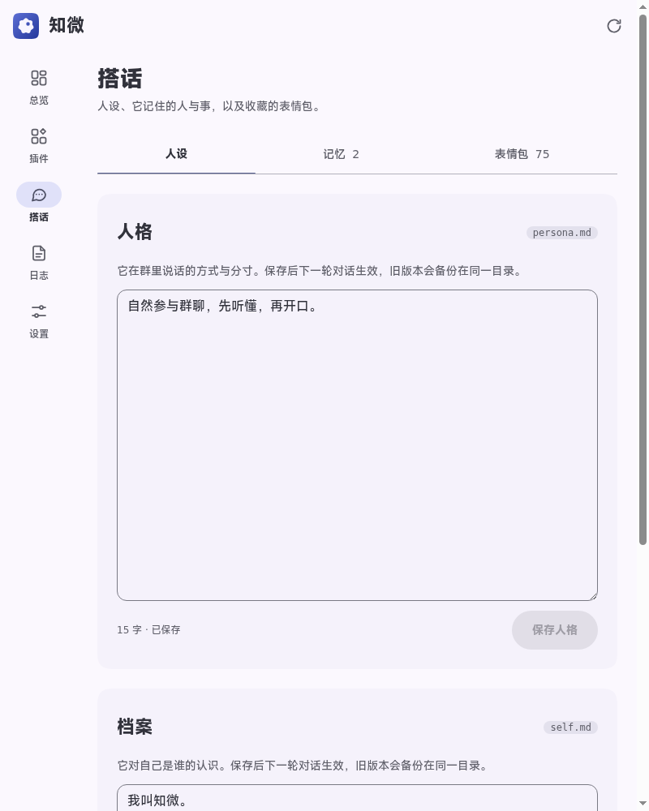

# 知微 WebUI 设计系统

2026-09-23 推倒重做后的现行规范。旧界面（松绿配色、开环图标、三层样式、`scheme-console`）已整体删除，不保留兼容。

取值的唯一来源是 `res/console/tokens.css`；本文说明它为什么长这样、组件该怎么用。两者冲突时以代码为准，并修正本文。

## 四个来源与裁决

冲突时的次序固定为：

```text
平台原生规范 > 可用性与无障碍 > 产品一致性 > M3E > Carbon > Miuix
```

| 来源 | 职责 | 在本产品里具体落成什么 |
| --- | --- | --- |
| Material 3 Expressive | 核心视觉语言 | HCT 配色角色（2025 规范）、字阶、形状级（含 increased 档）、弹簧动效、状态层、按压形变、分组列表、Cookie 形状 |
| Apple HIG | 交互与平台体验 | 系统字体、安全区、跟随系统明暗 / 增强对比度 / 减少动态、输入框 ≥16px（防 iOS 缩放）、大标题滚出后由顶栏接管、层级页左上返回、原生 `dialog` 与 `select` |
| Carbon | Web、响应式与信息密度 | 间距级 2/4/8/12/16/24/32/40/48/64、列表-详情、工具栏、结构化列表、行内校验、骨架屏、日志这种高密度等宽数据区 |
| Miuix | 只做视觉精修 | 连续曲率圆角（`corner-shape: squircle`，渐进增强）、1.75px 图标笔画、数字等宽；不引入任何颜色、组件或交互 |
| WCAG 2.2 AA | 下限 | 见文末「无障碍」 |

几处按次序裁决的例子：

- **文本框标签**：M3 用浮动标签，Carbon 用常驻上方标签。常驻标签更好读、输入后不消失（可用性 > M3E），取 Carbon。
- **描边**：M3 2025 的描边按钮、搜索栏用 `outline-variant` 或无边框，对比度不到 3:1。控件边界按 WCAG 1.4.11 统一用 `outline`（无障碍 > M3E）。
- **窗口断点**：M3 的 600 / 840 / 1200 与 Carbon 的 672 / 1056 / 1312 冲突，取 M3E。
- **触控尺寸**：触屏 48px（M3 目标尺寸，高于 HIG 44pt 与 WCAG 24px）；精确指针收到 40px。依据是平台的输入方式（`pointer: fine`），不是屏幕宽度。
- **单字符快捷键**：旧界面的 `1–5` 换页与 `/` 聚焦违反 WCAG 2.1.4，删除。

## 令牌

两级命名：`--md-sys-*` 与 M3 规范同名，查规范就能读懂；`--zw-*` 是知微自己的产品令牌（间距、外壳、控件尺寸、安全区、焦点环）。

### 颜色

由 `scripts/make-tokens.py` 生成，**不要手改**：靛青种子 `#3f51b5` → Material Color Utilities 的 Tonal Spot 变体、2025 规范 → 全部系统角色。共四档：浅、深、浅·增强对比、深·增强对比（`contrast_level` 0.5，对应 `prefers-contrast: more`）。

M3 只有 error 一种语义色。`success` 与 `warning` 按 M3 自定义色的做法生成：原色先向种子色相 harmonize，再用同一套规则取 `color / on-color / color-container / on-color-container`，于是明度结构与主色同构。

同一次运行把浅深两档的 `surface` 写进 `index.html` 的 `theme-color` 与清单，装到桌面后状态栏与顶栏没有接缝；Rust 测试核对两处一致。

| 配对 | 浅 | 深 | 浅·增强 | 深·增强 |
| --- | --- | --- | --- | --- |
| on-surface / surface | 12.10 | 15.36 | 14.84 | 19.29 |
| on-surface-variant / surface | 6.09 | 8.40 | 9.45 | 9.81 |
| on-primary / primary | 6.07 | 6.08 | 7.04 | 7.09 |
| on-primary-container / primary-container | 6.07 | 6.06 | 4.66 | 4.66 |
| on-secondary-container / secondary-container | 6.13 | 6.10 | 4.65 | 4.65 |
| outline / surface（控件边界） | 4.04 | 4.19 | 6.09 | 6.28 |
| error / 日志底 | 6.37 | 7.82 | 9.89 | 10.64 |
| warning / 日志底 | 6.39 | 12.37 | 9.98 | 12.37 |
| inverse-on-surface / inverse-surface（提示条） | 7.10 | 7.12 | 11.16 | 11.09 |

增强对比档里容器配对反而低于标准档（4.66 < 6.07）：2025 规范在这一档把容器压深、前景换成纯白，仍在 AA 之上。这是算法的取舍，不手调。

角色用法：`primary` 只给主动作与强调文字；`primary-container` 全页只有运行卡一处；`secondary-container` 表示选中（导航、筛选、单选、当前列表项）；`outline` 画控件边界；`outline-variant` 只做装饰分隔；`on-surface-variant` 写次要文字。**没有任何文字用 `outline` 写。**

### 字阶、形状、动效

| 类别 | 取值 |
| --- | --- |
| 字体 | `system-ui` → 苹方 / HarmonyOS Sans / MiSans / 思源黑体；等宽 `ui-monospace` 起。不加载网络字体 |
| 字阶 | M3 十五级，单位 rem，跟随用户字号设置；字重 400 / 500 / 600（强调）/ 700（标题与读数） |
| 形状 | 4 / 8 / 12 / 16 / 20 / 28 / 32 / 48 / full。卡片 28，列表组两端 20、组内 4，文本框 12，芯片 8 |
| 动效 | 空间弹簧 fast 350ms `cubic-bezier(.42,1.67,.21,.9)`、default 500ms；效果 150 / 200 / 300ms 不回弹。减少动态时空间类全部归零 |
| 状态层 | hover 8%、focus 10%、pressed 10%；停用前景 38%、容器 10% |
| 高度 | 只给浮层：提示条、对话框用 level3，「回到最新」用 level2；表面层次靠容器色 |

### 外壳

| 窗口 | 导航 | 其它 |
| --- | --- | --- |
| < 600 | 底部导航栏 64px + 安全区 | 顶栏 64px；页边距 16 |
| 600–839 | 收起的导航轨 96px，图标上字下 | 页边距 24 |
| ≥ 840 | 展开的导航轨 248px，指示条包住图标与文字 | 插件页列表-详情并排，详情栏钉在视口内自滚 |
| ≥ 1200 | 同上 | 页边距 32；内容最宽 1240 |

## 组件

| 组件 | 行为 | 无障碍 |
| --- | --- | --- |
| 导航 | 五个真链接：总览、插件、搭话、日志、设置 | `aria-current="page"`；浏览器前进后退有效 |
| 页头 | 每页一个 h1；滚出顶栏后顶栏接过页名、换容器色 | 换页后焦点落到 h1；`document.title` 同步 |
| 按钮 | filled > tonal > outlined > text；danger 只给不可撤销动作；按下时全圆角收成 12px | 可见焦点环；忙碌 `aria-busy` 防重复提交 |
| 开关 | 52×32 轨道，开时滑块变大并移位 | 原生 button + `role="switch"` + `aria-checked`；名字固定为「启用 某某」，状态只在 `aria-checked` |
| 筛选芯片 | 可多个并列，选中带对勾 | `aria-pressed`；触屏命中区补到 48 |
| 连接按钮组 | 单选；选中项变全圆角 | 原生 `radio`，方向键由浏览器处理 |
| 页签 | 搭话页的人设 / 记忆 / 表情包 | APG 自动激活：左右、Home、End；roving tabindex |
| 分组列表 | 行身是链接（伪元素铺满），尾部开关独立 | 链接与按钮不嵌套；当前项 `aria-current` |
| 文本框 | 标签常驻上方；离开或回车即保存；未改动不提交 | 错误就地显示并 `role="alert"`，`aria-invalid` + `aria-describedby` |
| 对话框 | 原生 `dialog`；危险操作先确认 | 初始焦点在「取消」；Esc 取消并回到触发点 |
| 提示条 | 成功 4 秒、失败 10 秒 | 成功 `status`、失败 `alert`；悬停或聚焦时暂停计时（2.2.1） |
| 日志区 | 等宽四列，窄屏正文换到第二行；级别永远带字 | 可键盘滚动的 `region`；高频日志不做实时播报 |
| 骨架屏 / 进度 | 首次进页出骨架；超过 150ms 顶栏出不确定进度条 | 加载中 `aria-busy` |

脚本侧的纪律：HTML 一律经 `h\`\`` 标签模板拼接，插值默认转义，只有 `raw()` 包过的片段原样输出；测试禁止直接往 `innerHTML` 写字面量模板。

## 功能取舍

「推倒重来」时砍掉的：独立的「命令」页（并入设置页的「维护命令」）、阅读密度切换、「装到桌面」卡片（留一行说明）、涟漪动画（CSS 状态层足够）、全部单字符快捷键。新增的：在这台设备上退出、配置项行内校验、人设编辑的未保存提示与离开页面提醒、表情包分页。

## 图标

`scripts/make-icon.py` 是唯一几何源。标记是 M3E 形状库的七瓣「曲奇」形，右上挖出一个焦点圆——知微，见微知著。108 网格，曲奇外缘半径 32.6，在半径 33 的安全圆内；16px 下焦点圆直径约 2.4px，仍可辨认。

- `icon.svg` 与 192 / 512 PNG：超椭圆（n=5）底板，种子色相的 50→28 调渐变，标记取 97 调；
- `icon-maskable-512.png` 与 `apple-touch-icon.png`：满底不透明方角，由系统裁形（HIG 不让自己画圆角）；
- `icon-monochrome.svg`：透明底纯白，供系统着色；总览运行卡背景里那枚放大的标记也用它做遮罩。

位图由无头 Chromium 渲染同一份 SVG，保证矢量与位图同源。界面内的功能图标是 24 网格、1.75px 圆头描边、`currentColor`，对辅助技术隐藏，名称由按钮承担。

## 无障碍（WCAG 2.2 AA）

| 条款 | 做法 |
| --- | --- |
| 1.4.3 / 1.4.11 对比度 | 颜色由算法保证并逐元素实测；控件边界用 `outline` |
| 1.4.1 颜色 | 开关同时变位置与大小；状态标签、日志级别都带文字 |
| 1.4.10 / 1.4.12 回流与文字间距 | 320px 不横向滚动；覆盖行高字距后仍不溢出 |
| 2.1.4 字符快捷键 | 不设任何单字符快捷键 |
| 2.2.1 计时 | 提示条可关闭，悬停 / 聚焦时暂停 |
| 2.4.3 / 2.4.7 焦点 | 换页焦点到 h1；焦点环 3px（增强对比时 4px） |
| 2.4.11 焦点不被遮挡 | `scroll-padding` 让出顶栏与底栏；测试逐个 Tab 检查 |
| 2.5.8 目标尺寸 | 触屏 48、精确指针 40，均高于 24 |
| 3.3.1 / 3.3.3 错误 | 行内说明哪里错、该怎么改 |
| 3.3.8 无障碍认证 | 口令框允许粘贴与密码管理器（`autocomplete="current-password"`） |
| 4.1.2 / 4.1.3 | 所有控件有名称与状态；搜索结果数、命令回执、保存结果走 live region |

## 验证

```sh
python3 scripts/make-tokens.py --check        # 配色与种子一致、theme-color 同步
cargo test --locked console                   # 令牌分层、颜色只在生成段、图标格式与透明通道、转义纪律
node tests/console.cjs                        # 隔离夹具上的交互、压力与无障碍矩阵
node tests/console-backend.cjs                # 隔离 release 实例：口令、SSE、资源逐字节一致、ETag
python3 scripts/audit-contrast.py             # 线上实例只读审计
```

`tests/console.cjs` 覆盖：解锁与口令抹除、导航焦点、列表-详情的慢回包竞态、行内校验、对话框焦点、页签键盘、表单草稿、日志 2400 行突发（无 ≥50ms 长任务）、暂停与筛选、导出、后台断流、断线退避、触控目标，以及 4 档宽度 × 浅深 × 6 页再加增强对比两档与搭话另两个页签，共 62 个快照的对比度、边界、名称、目标与占位文字审计。设置 `ACUMEN_AXE_CORE` 时追加 axe-core 的 WCAG 2.x A/AA 规则。

自动检查不等于完整的 WCAG 认证。VoiceOver / TalkBack 的实际朗读、iOS 安装与真机安全区仍需在设备上人工验收。

下列截图来自隔离夹具，数据只作演示。




